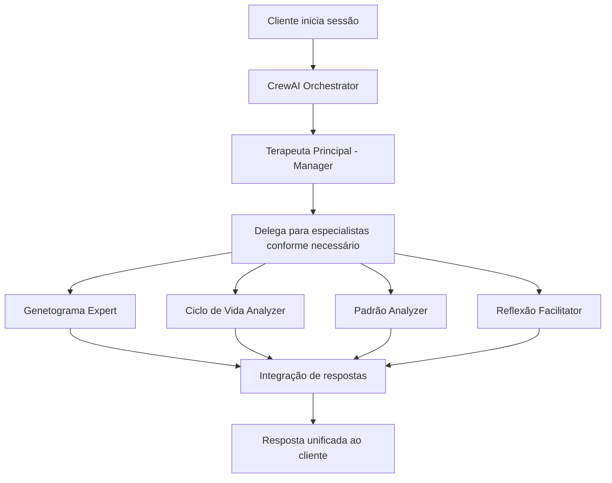

# 🧠 Sistema de Terapia Familiar - Guia Completo do Projeto

## 📋 Índice
- [Visão Geral](#visão-geral)
- [Arquitetura do Sistema](#arquitetura-do-sistema)
- [Instalação e Configuração](#instalação-e-configuração)
- [Como Usar](#como-usar)
- [Estrutura do Código](#estrutura-do-código)
- [Agentes Especializados](#agentes-especializados)
- [Base de Conhecimento](#base-de-conhecimento)
- [Configuração Técnica](#configuração-técnica)
- [Troubleshooting](#troubleshooting)
- [Desenvolvimento e Manutenção](#desenvolvimento-e-manutenção)

## 🎯 Visão Geral

### O que é?
Sistema inteligente de terapia familiar baseado na teoria de **Carter & McGoldrick**, que utiliza uma equipe de agentes especializados trabalhando em conjunto através do framework **CrewAI** para oferecer suporte terapêutico integrado.

### Objetivos
- **Acolhimento Empático**: Receber famílias com compreensão e cuidado
- **Análise Sistêmica**: Avaliar dinâmicas familiares de forma holística
- **Orientação Especializada**: Oferecer insights baseados em teoria comprovada
- **Processo Natural**: Facilitar conversas terapêuticas fluidas

### Tecnologias Principais
- **CrewAI**: Orquestração de agentes IA
- **Google Gemini**: Modelo de linguagem (gemini-1.5-flash)
- **Streamlit**: Interface web interativa
- **Python**: Linguagem de desenvolvimento

## 🏗️ Arquitetura do Sistema

### Conceito Central: Equipe Terapêutica
```
🤝 EQUIPE TERAPÊUTICA COMPLETA
├── 👨‍⚕️ Terapeuta Principal (Manager)
├── 🌳 Especialista em Genetograma
├── 🔄 Analista de Ciclo de Vida
├── 🧩 Analista de Padrões
└── 💭 Facilitador de Reflexão
```

### Fluxo de Trabalho


## ⚙️ Instalação e Configuração

### Pré-requisitos
```bash
Python 3.8+
pip (gerenciador de pacotes Python)
Chave API do Google Gemini
```

### Passo a Passo

1. **Clone/baixe o projeto**
```bash
cd "caminho/para/Terapia MVP"
```

2. **Instale dependências**
```bash
pip install streamlit crewai python-dotenv
```

3. **Configure variáveis de ambiente**
Crie arquivo `.env` na raiz do projeto:
```env
GEMINI_API_KEY=sua_chave_api_aqui
DEBUG=false
ENABLE_MEMORY=false
```

4. **Execute o sistema**
```bash
streamlit run app.py
```

5. **Acesse no navegador**
```
http://localhost:8501
```

## 🚀 Como Usar

### Interface Principal

#### 1. Campo de Mensagem (Fixo no Topo)
- **Localização**: Sempre visível na parte superior
- **Função**: Digite sua mensagem e clique "Enviar"
- **Dica**: Funciona para iniciar sessão ou continuar conversa

#### 2. Área de Conversação (Rolável)
- **Mensagens do Cliente**: Fundo claro, alinhadas à direita
- **Respostas da Equipe**: Fundo azul, alinhadas à esquerda
- **Navegação**: Role para ver histórico completo

#### 3. Painel Lateral
- **Status da Sessão**: Contador de mensagens
- **Informações**: Sobre a equipe terapêutica
- **Botão Limpar**: Reset completo da sessão

### Exemplos de Uso

#### Iniciando uma Sessão
```
Cliente: "Olá, estou passando por dificuldades no meu casamento"
Sistema: [Equipe se mobiliza para acolhimento inicial]
```

#### Compartilhando Informações Familiares
```
Cliente: "Temos dois filhos adolescentes e minha sogra mora conosco"
Sistema: [Genetograma Expert e Ciclo de Vida se ativam]
```

#### Explorando Padrões
```
Cliente: "Isso sempre acontece quando tentamos conversar"
Sistema: [Padrão Analyzer identifica dinâmicas recorrentes]
```

## 📁 Estrutura do Código

### Organização de Arquivos
```
Terapia MVP/
├── 📄 app.py                    # Interface Streamlit
├── 📄 crew_orchestrator.py      # Orquestrador CrewAI
├── 📄 config.py                 # Configurações globais
├── 📄 .env                      # Variáveis de ambiente
├── 📁 agents/                   # Agentes especializados
│   ├── terapeuta_principal.py
│   ├── genetograma_expert.py
│   ├── ciclo_vida_analyzer.py
│   ├── padrao_analyzer.py
│   └── reflexao_facilitator.py
├── 📁 knowledge/                # Base de conhecimento
│   ├── carter_mcgoldrick.py
│   ├── genetograma_guide.py
│   └── quebra_gelos.py
└── 📄 GUIA_PROJETO.md          # Este documento
```

### Arquivos Principais

#### `app.py` - Interface do Usuário
```python
# Responsabilidades:
- Interface Streamlit
- Gerenciamento de sessão
- Layout responsivo
- Integração com orchestrator
```

#### `crew_orchestrator.py` - Coordenação Central
```python
# Responsabilidades:
- Orquestração CrewAI
- Criação de tasks dinâmicas
- Processo hierárquico
- Gerenciamento de estado
```

#### `config.py` - Configurações
```python
# Responsabilidades:
- Configuração do LLM
- Validação de API keys
- Parâmetros globais
```

## 👥 Agentes Especializados

### 1. 👨‍⚕️ Terapeuta Principal (Manager)
**Função**: Coordenador geral da equipe
```python
# Características:
- allow_delegation=True
- Liderança empática
- Visão sistêmica
- Tomada de decisão
```

### 2. 🌳 Especialista em Genetograma
**Função**: Análise de dinâmicas familiares
```python
# Especialidades:
- Mapeamento familiar
- Padrões geracionais
- Relacionamentos
- Estrutura familiar
```

### 3. 🔄 Analista de Ciclo de Vida
**Função**: Identificação de estágios familiares
```python
# Especialidades:
- Fases do desenvolvimento
- Transições familiares
- Marcos evolutivos
- Adaptações necessárias
```

### 4. 🧩 Analista de Padrões
**Função**: Identificação de dinâmicas recorrentes
```python
# Especialidades:
- Padrões comportamentais
- Ciclos disfuncionais
- Interações repetitivas
- Análise sistêmica
```

### 5. 💭 Facilitador de Reflexão
**Função**: Promoção de insights
```python
# Especialidades:
- Perguntas reflexivas
- Facilitação de diálogo
- Insights terapêuticos
- Processo de mudança
```

## 📚 Base de Conhecimento

### Carter & McGoldrick
**Arquivo**: `knowledge/carter_mcgoldrick.py`
```python
# Conteúdo:
- Teoria sistêmica familiar
- Ciclo de vida familiar
- Abordagens terapêuticas
- Conceitos fundamentais
```

### Guia do Genetograma
**Arquivo**: `knowledge/genetograma_guide.py`
```python
# Conteúdo:
- Símbolos e notações
- Técnicas de mapeamento
- Interpretação de padrões
- Aplicação prática
```

### Quebra-gelos Terapêuticos
**Arquivo**: `knowledge/quebra_gelos.py`
```python
# Conteúdo:
- Técnicas de acolhimento
- Perguntas iniciais
- Facilitação de diálogo
- Criação de rapport
```

## 🔧 Configuração Técnica

### Variáveis de Ambiente (.env)
```env
# Obrigatórias
GEMINI_API_KEY=sua_chave_google_gemini

# Opcionais
DEBUG=false                 # Modo debug (true/false)
ENABLE_MEMORY=false        # Memory CrewAI (desabilitado)
```

### Configuração do LLM
```python
# config.py
model_name = "gemini/gemini-1.5-flash"
temperature = 0.7
api_base = None  # Padrão CrewAI
```

### Processo CrewAI
```python
# crew_orchestrator.py
process = Process.hierarchical
manager_llm = Config.get_llm()
verbose = Config.DEBUG
# memory desabilitado (evita erros OpenAI)
```

## 🔍 Troubleshooting

### Problemas Comuns e Soluções

#### 1. Erro de API Key
```
❌ Erro: Invalid API key
✅ Solução: 
- Verificar .env existe
- Confirmar GEMINI_API_KEY válida
- Reiniciar aplicação
```

#### 2. Erro de Dependências
```
❌ Erro: ModuleNotFoundError
✅ Solução:
pip install streamlit crewai python-dotenv
```

#### 3. Erro de Memory/Embeddings
```
❌ Erro: OpenAI embeddings
✅ Solução: 
- ENABLE_MEMORY=false no .env
- Já configurado por padrão
```

#### 4. Interface não carrega
```
❌ Erro: Streamlit não abre
✅ Solução:
- Verificar porta 8501 livre
- streamlit run app.py --port 8502
```

#### 5. Respostas muito longas
```
❌ Problema: Respostas excessivamente detalhadas
✅ Solução: 
- Sistema já calibrado
- Tasks incluem instruções de proporcionalidade
```

### Debug e Logs
```python
# Ativar debug no .env
DEBUG=true

# Logs aparecem no console
logging.basicConfig(level=logging.INFO)
```

## 🛠️ Desenvolvimento e Manutenção

### Adicionando Novos Agentes

1. **Criar arquivo do agente**
```python
# agents/novo_agente.py
from crewai import Agent
from config import Config

class NovoAgente:
    def get_agent(self):
        return Agent(
            role="Especialista em...",
            goal="Objetivo específico...",
            backstory="História e contexto...",
            llm=Config.get_llm(),
            verbose=Config.DEBUG
        )
```

2. **Adicionar ao orquestrador**
```python
# crew_orchestrator.py
from agents.novo_agente import NovoAgente

# No __init__:
self.novo_agente = NovoAgente()

# Na crew:
agents=[
    # ... outros agentes
    self.novo_agente.get_agent()
]
```

### Expandindo Base de Conhecimento

1. **Criar novo arquivo de conhecimento**
```python
# knowledge/nova_teoria.py
NOVA_TEORIA = """
Conteúdo da nova base teórica...
"""
```

2. **Integrar aos agentes relevantes**
```python
# agents/agente_relevante.py
from knowledge.nova_teoria import NOVA_TEORIA

# Usar no backstory do agente
```

### Customizando Interface

1. **Modificar layout**
```python
# app.py
# Ajustar layout Streamlit
col1, col2 = st.columns([3, 1])
```

2. **Adicionar funcionalidades**
```python
# Exemplos:
- Exportar conversas
- Histórico de sessões
- Configurações de usuário
```

### Atualizações de Dependências
```bash
# Verificar versões atuais
pip list

# Atualizar quando necessário
pip install --upgrade crewai streamlit
```

## 📊 Métricas e Monitoramento

### Status da Sessão
- **Mensagens trocadas**: Contador automático
- **Sessão ativa**: Status booleano
- **Contexto definido**: Informação familiar coletada

### Logs do Sistema
```python
# Tipos de log disponíveis:
logger.info("✅ Operação bem-sucedida")
logger.error("❌ Erro encontrado") 
logger.warning("⚠️ Atenção necessária")
```

## 🎯 Boas Práticas

### Para Usuários
1. **Seja específico**: Compartilhe detalhes relevantes
2. **Seja paciente**: Sistema processa com cuidado
3. **Explore livremente**: Faça perguntas sobre família
4. **Use reset**: Limpe sessão quando necessário

### Para Desenvolvedores
1. **Siga padrões CrewAI**: Use documentação oficial
2. **Mantenha proporcionality**: Evite respostas excessivas
3. **Teste regularmente**: Valide mudanças
4. **Documente alterações**: Atualize este guia

## 🚀 Próximos Passos

### Possíveis Melhorias
- [ ] Exportar sessões em PDF
- [ ] Salvar progress entre sessões
- [ ] Interface multi-idioma
- [ ] Integração com calendários
- [ ] Módulo de exercícios familiares
- [ ] Dashboard para terapeutas
- [ ] API REST para integrações
- [ ] Análise de sentimentos
- [ ] Recommendations personalizadas

### Contribuições
Para contribuir com o projeto:
1. Entenda a arquitetura atual
2. Siga padrões estabelecidos
3. Teste thoroughly
4. Documente mudanças
5. Mantenha foco terapêutico

---

## 📞 Suporte

Para dúvidas ou problemas:
1. Consulte este guia primeiro
2. Verifique logs do sistema
3. Teste configurações básicas
4. Documente erro específico

**Sistema criado com ❤️ para apoiar famílias em sua jornada de crescimento e conexão.**

---
*Documento atualizado: Julho 2025*
*Versão: 1.0*
*Autor: Sistema de Terapia Familiar IA*
